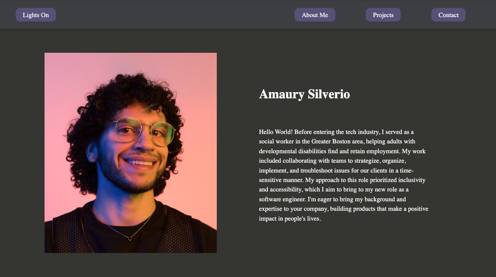

# Portfolio

This is a portfolio website created using React.JS that includes a dark mode and light mode toggle. This project was created to help me understand state management and component structuring in React; based on the readings from part 0 & 1 of FullStackOpen.

All styling and responsiveness, including the navigation bar, were created by me using CSS.

# How To Run

1. Clone repo
2. cd to /-Sprint1-Portfolio directory & run: npm install
3. run: npm run dev

